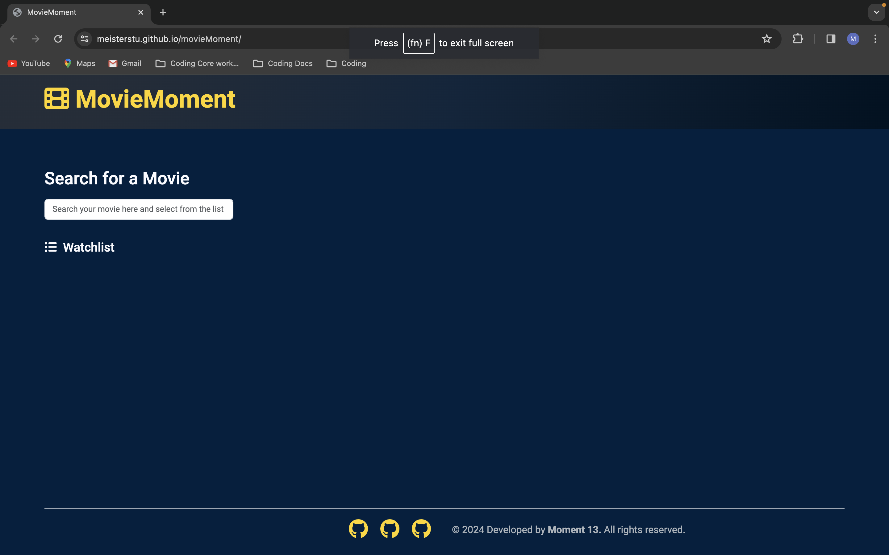

# MovieMoment - Your Favourite Watchlist
Explore and discover your favourite movies or those you're eager to watch. Dive into movie details, poster, and trailer, and effortlessly curate your personal watchlist. Enjoy the ultimate MovieMoment with a seamless and user-friendly watchlist experience.

## Description

This project aims to create a movie dashboard with form inputs. When a user searches for a movie they are presented with a list of options. On selection, information about the movie is displayed along with the trailer.

## Table of Contents

- [Usage](#usage)
- [Credits](#credits)
- [License](#license)
- [Deployment](#deployment)
- [License](#license)
- [Badges](#badges)

## Usage

The search box is on the left side of the page. When a valid movie is searched for, a list of options is displayed. On selection, movie information is displayed - including the poster and movie trailer. There is an option to add movies to a watchlist. The movies in the watchlist can be clicked to bring up the relevant information. If an invalid movie is searched, a warning message flashes up. The watchlist can be cleared from local storage by pressing the 'Clear History' button.

Screenshot of the blank form

Screenshot of the form in use

## Credits

This README was created by following the Good-README-Guide on git.bootcampcontent:

https://git.bootcampcontent.com/uk-edx-16-week/UK-VIRT-FE-PT-10-2023-U-LOLC/-/blob/main/01-html-git-github-module/04-code-refactor-lesson/challenge/Good-README-Guide.md

## Deployment

This project is deployed and accessible at the following URLs:

- [Demo](https://meisterstu.github.io/movieMoment/)
- [GitHub Repository](https://github.com/Meisterstu/movieMoment)

> Save your favourite movies to our watchlist at MovieMoment.

## License

Copyright (c) 2024 Developed by Moment 13 - contributors [Skilton, J.](https://github.com/jsskilton) | [Ponte, N.](https://github.com/deponte-designer) | [Rainforth, S.](https://github.com/Meisterstu)

Permission is hereby granted, free of charge, to any person obtaining a copy of this software and associated documentation files (the "Software"), to deal in the Software without restriction, including without limitation the rights to use, copy, modify, merge, publish, distribute, sublicense, and/or sell copies of the Software, and to permit persons to whom the Software is furnished to do so, subject to the following conditions:

The above copyright notice and this permission notice shall be included in all copies or substantial portions of the Software.

THE SOFTWARE IS PROVIDED "AS IS", WITHOUT WARRANTY OF ANY KIND, EXPRESS OR IMPLIED, INCLUDING BUT NOT LIMITED TO THE WARRANTIES OF MERCHANTABILITY, FITNESS FOR A PARTICULAR PURPOSE AND NONINFRINGEMENT. IN NO EVENT SHALL THE AUTHORS OR COPYRIGHT HOLDERS BE LIABLE FOR ANY CLAIM, DAMAGES OR OTHER LIABILITY, WHETHER IN AN ACTION OF CONTRACT, TORT OR OTHERWISE, ARISING FROM, OUT OF OR IN CONNECTION WITH THE SOFTWARE OR THE USE OR OTHER DEALINGS IN THE SOFTWARE.

## Badges

